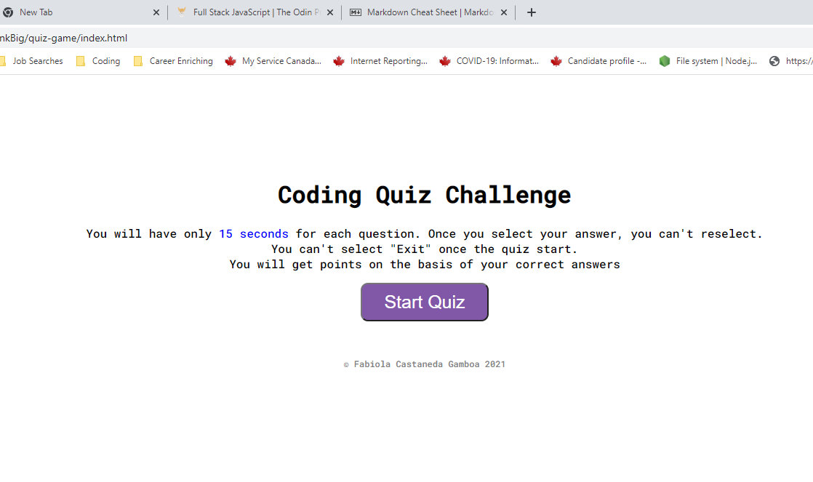

# quiz-game

## This project has been a big challenge for me but it is a great way to make students to think and to google more and more information about coding. many good sources were found and many things to learn.
### It is a site originally call *Code Quiz Game*. It is about a quiz related to coding, it has a timing of 75 seconds and if you pick the wrog answer, then the clock will be substractiong 10 seconds fro your time remaining

---
# We used in this project:
1. **HTML**
2. **CSS**
3. **JavaScript**

## GitHub Repo: https://github.com/Fabskickass/quiz-game

## Deployed URL: https://fabskickass.github.io/quiz-game/

[**addEventListener information**] (https://developer.mozilla.org/en-US/docs/Web/API/EventTarget/addEventListener)

[] (https://www.w3schools.com/Jsref/met_element_addeventlistener.asp)

